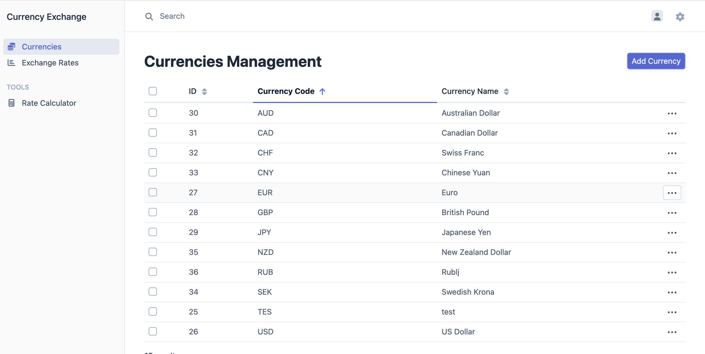
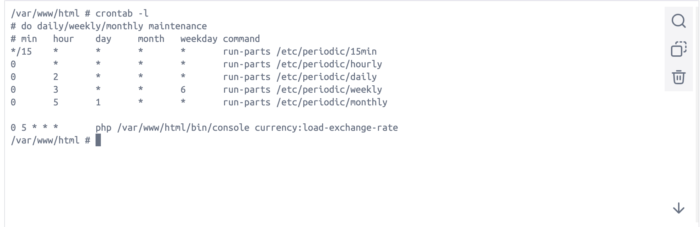
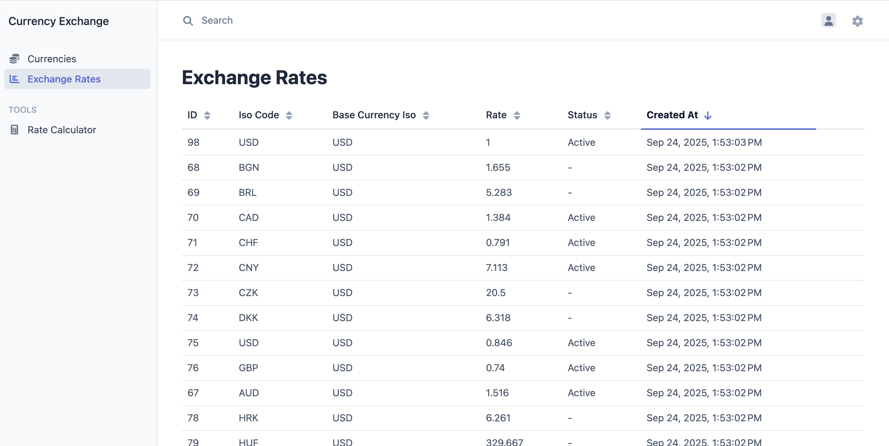
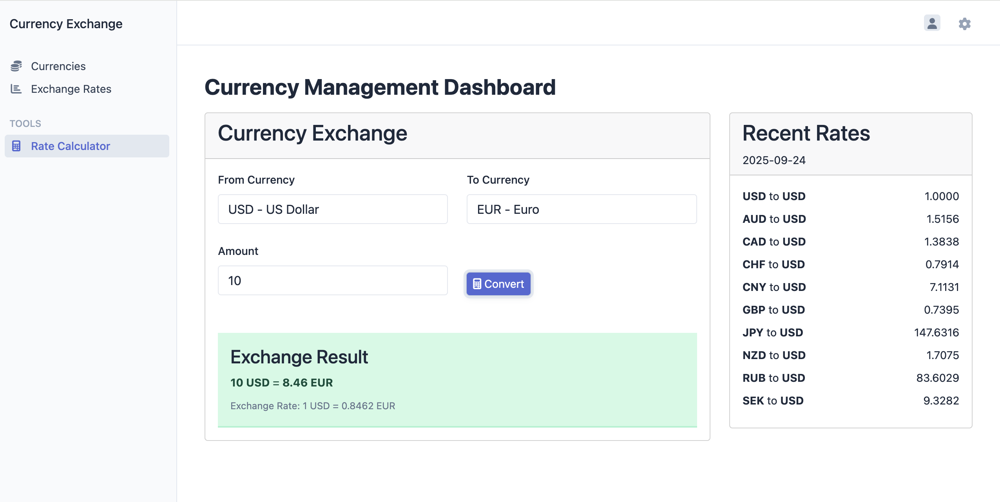

# Currency exchange service

### Stack
- PHP >= 8.4
- Symfony 7.3
- PostgreSQL >=16
- EasyAdminBundle
- Docker

### Setup local environment

```shell
# 1. Setup .env file - the dist is ready to use
cp .env.dist .env.local

# 2. Run Docker environment
docker compose up

# 3. Get inside fpm container (to run php-based commands)
docker compose exec fpm sh

# 4. Install dependencies: (run inside fpm container)
composer install

# 5. Migrate the Database: (run inside fpm container)
php bin/console doctrine:migrations:migrate

```

```dotenv
# Set up CURRENCY_API_KEY in .env.local file
CURRENCY_API_KEY=your_api_key_here
# You can get a free API key from https://www.exchangerate-api.com/

```

```shell
# 6. Run the command to load exchange rates: (run inside fpm container)
php bin/console currency:load-exchange-rate

```


### Testing

***Preparing the Database***
```shell
# Create
php bin/console --env=test doctrine:database:create
# Migrate
php bin/console --env=test doctrine:migrations:migrate
```

***Running Unit tests***
```shell
# Run all Unit Tests
php bin/phpunit

```


### Module explanation

This module stores and converts currencies.

- [x] The module has a predefined list of currencies, which it also can be changed in the admin panel (using EasyAdminBundle).


- [x] Currencies rates downloads from https://freecurrencyapi.com/ . It loads add currencies with USD as the base currency, and can be easily to exchange all currencies with some calculations.
- [x] Daily loading can be set up using cron job (look at the .docker/local/php-fpm/Dockerfile:63)

- [x] `\App\Service\ConverterCurrencyService` - the service for converting prices from one currency to another, which can be injected in any place of the project. (Usage: $converter->convert(123, 'USD', 'RUB');)
- [x] There is a Dashboard with exchange rates in the admin panel.


In addition, there is a dashboard with statistics on how many times the conversion was requested for each currency.

